# Impulso Cursos

Sistema fictício de gestão de alunos desenvolvido em PHP e PostgreSQL.

O sistema permite cadastrar, consultar, filtrar, editar e excluir alunos, além de oferecer login para funcionários.

## Funcionalidades

- Cadastrar alunos
- Consultar alunos
- Editar alunos
- Excluir alunos
- Pesquisar alunos por ID ou CPF
- Filtrar o relatório por turma e situação
- Validar matematicamente os dígitos do CPF no cadastro e na edição
- Fazer login
- Sair da conta

## Requisitos

- PHP com a extensão `pdo_pgsql` habilitada
- PostgreSQL

## Tecnologias utilizadas

- PHP
- PDO
- PostgreSQL
- HTML
- CSS
- Git
- GitHub

## Protótipos

Para abrir e visualizar os protótipos `.excalidraw` no VS Code, instale a extensão Excalidraw.

### Telas

#### Tela inicial

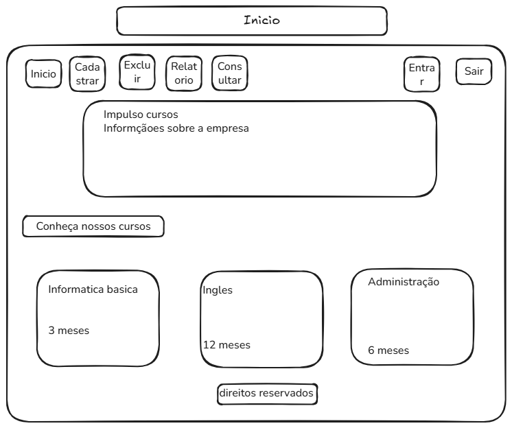

#### Tela de login

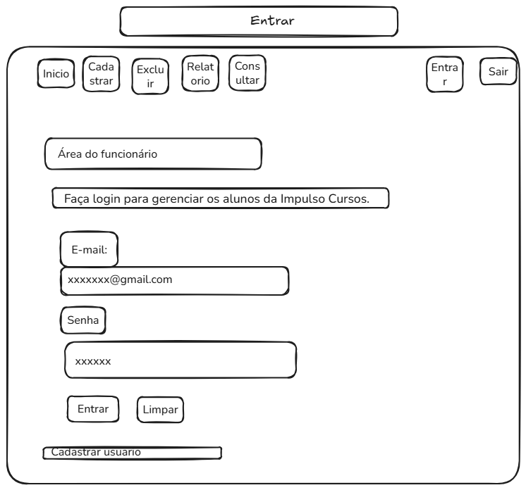

#### Tela de cadastro

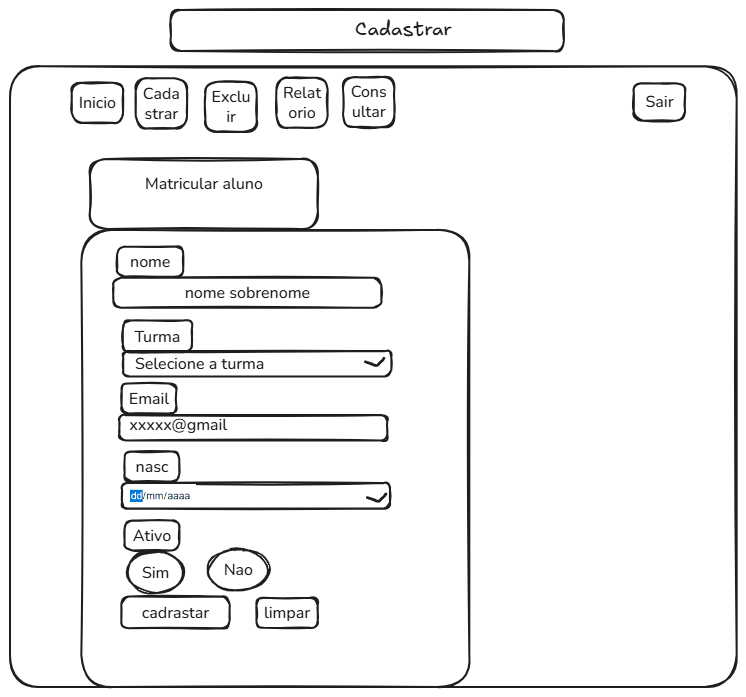

#### Tela de cadastro de aluno

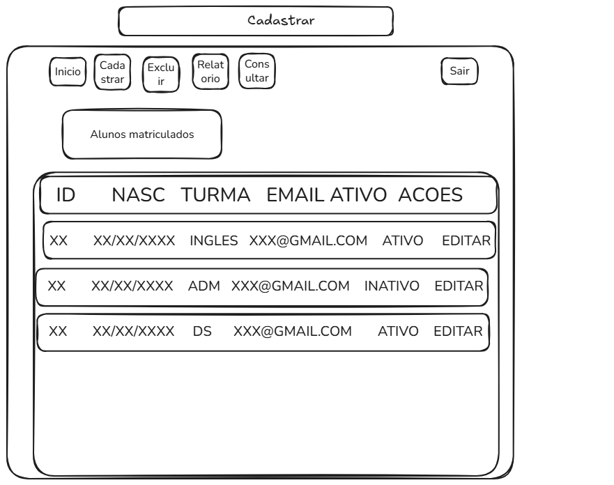

#### Tela de exclusão

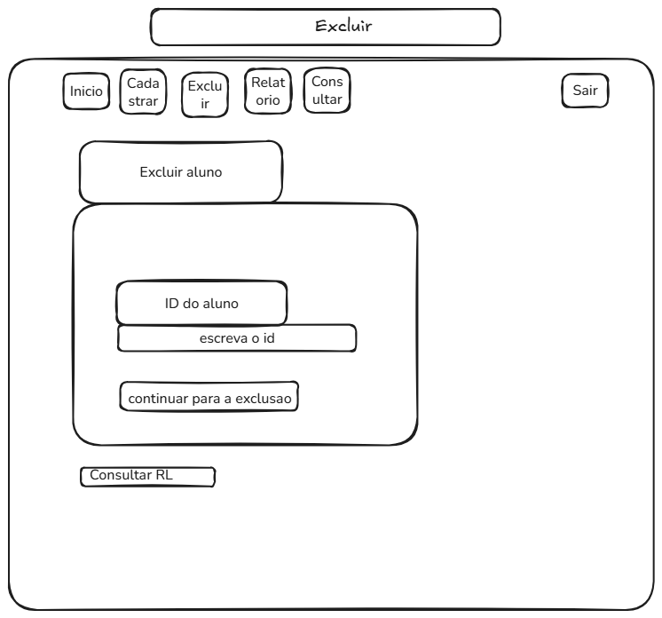

#### Tela de confirmação de exclusão

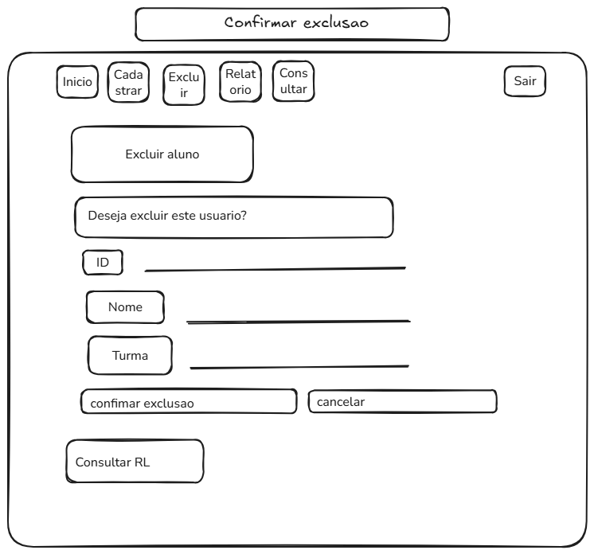

#### Tela de resultado da consulta

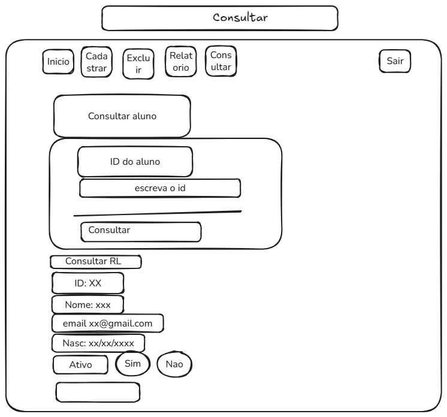

## Evolução do projeto no Trello

O desenvolvimento do **Impulso Cursos** foi acompanhado por um quadro Kanban no Trello.

As imagens abaixo registram a evolução das tarefas conforme os commits do projeto avançaram.

<!-- markdownlint-disable MD033 -->
<details>
<summary><strong>Primeiros 7 commits</strong></summary>

Nesta etapa foi organizada a base inicial do projeto, incluindo estrutura, CRUD de alunos, login, documentação e versionamento.

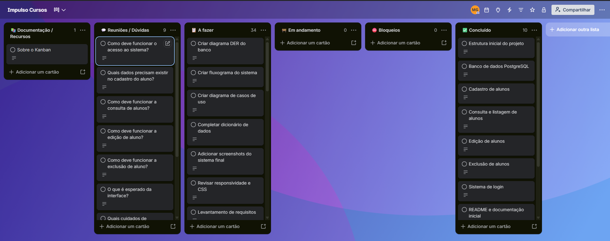

</details>

<details>
<summary><strong>Commits 8–15</strong></summary>

Continuação da documentação e criação dos diagramas do sistema e do banco de dados.

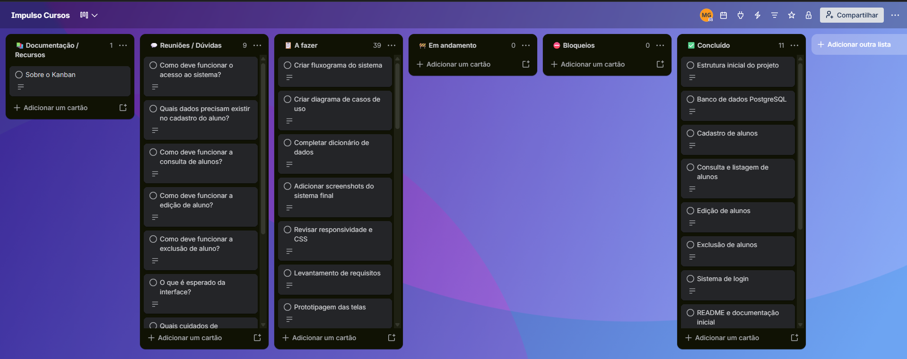

</details>

<details>
<summary><strong>Commits 16–21</strong></summary>

Evolução da documentação, dicionário de dados e segurança das senhas com hash.

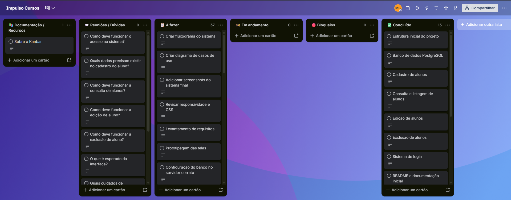

</details>

<details>
<summary><strong>Commits 22–28</strong></summary>

Melhorias no cadastro de usuários, autenticação, mensagens e tratamento de erros.

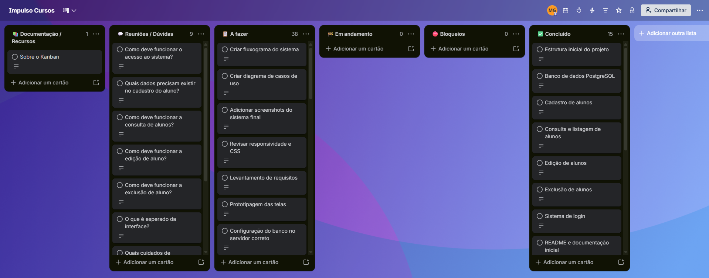

</details>

<details>
<summary><strong>Commits 29–35</strong></summary>

Testes de autenticação e cadastro, além da criação dos protótipos das telas no Excalidraw.


</details>

<details>
<summary><strong>Commits 36–42</strong></summary>

Inclusão das imagens dos protótipos no README e documentação adicional das páginas do sistema.

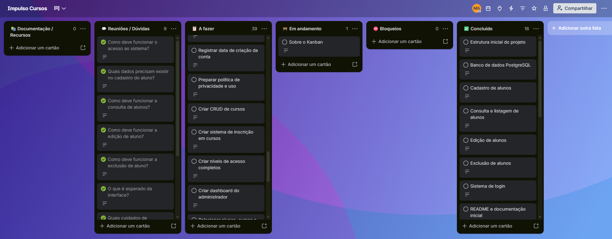

</details>

<details>
<summary><strong>Commits 43–49</strong></summary>

Criação do briefing do cliente, melhorias de segurança na exibição de dados e revisão da conexão e do schema PostgreSQL.

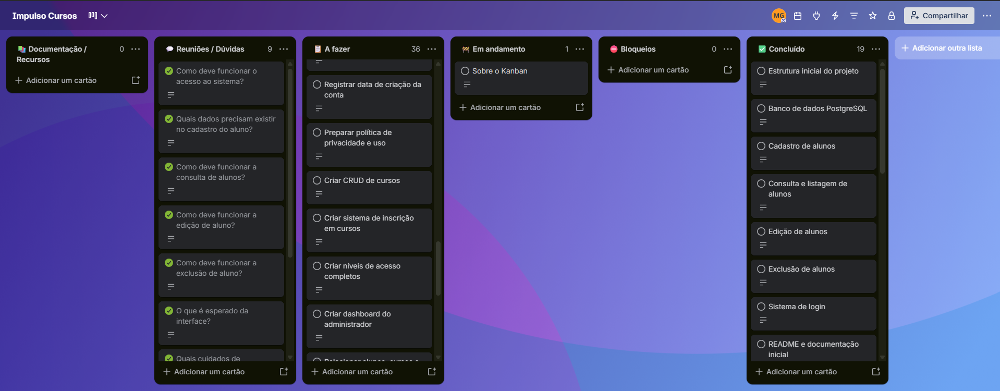

</details>

<details>
<summary><strong>Commits 50–56</strong></summary>

Implementação de CPF no cadastro, edição, relatório e busca, além de melhorias nos filtros e no CSS.

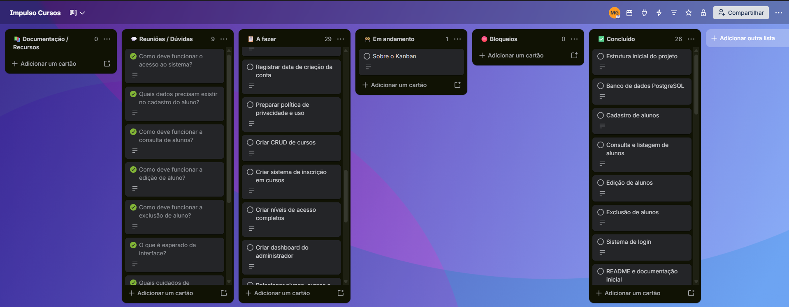

</details>

<details>
<summary><strong>Commits 57–63</strong></summary>

Refatoração e organização do código, revisão dos arquivos de sessão/login e melhoria da estrutura dos scripts do banco de dados.

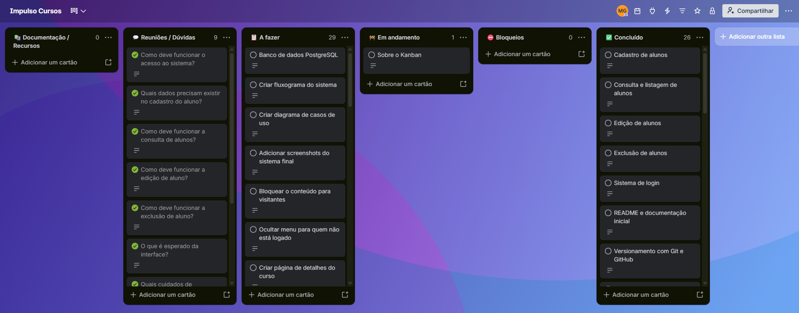

</details>
<!-- markdownlint enable MD033 -->

## Estrutura do projeto

```text
mini_sistema/
├── app/
├── css/
│   └── style.css
├── database/
│   ├── auto_destruicao/
│   │   └── reset_database.pgsql
│   ├── ajustar_senha.sql
│   ├── connect_postgres.php
│   ├── table.pgsql
│   └── verificar_user.php
├── includes/
├── login/
├── index.php
└── README.md
```

## Banco de dados

1. Crie ou selecione o banco PostgreSQL que será usado pelo projeto.
2. Configure host, banco, usuário e senha em `database/connect_postgres.php`.
3. No terminal aberto na pasta que contém `mini_sistema`, execute o script de criação segura. Substitua `HOST`, `USUARIO` e `BANCO` pelos valores configurados para o projeto:

   ```powershell
   psql -h HOST -U USUARIO -d BANCO -f mini_sistema/database/table.pgsql
   ```

[table.pgsql](database/table.pgsql) cria as tabelas ausentes sem apagar dados existentes. Ele não atualiza a estrutura de tabelas que já existem.

**Atenção:** [reset_database.pgsql](database/auto_destruicao/reset_database.pgsql) apaga e recria as tabelas `alunos` e `usuarios`; todos os registros delas são perdidos. Use somente em desenvolvimento e após confirmar o banco e fazer backup.

## Executar o sistema

1. Confirme que o PHP está com `pdo_pgsql` habilitado e que a conexão com o banco funciona.
2. Abra o terminal na pasta que contém `mini_sistema` e inicie o servidor:

    ```powershell
    php -S 127.0.0.1:8000
    ```

3. Acesse `http://127.0.0.1:8000/mini_sistema/`.
4. Crie a primeira conta de funcionário em `http://127.0.0.1:8000/mini_sistema/login/cadastrar.php`.

## Teste de autenticação

No terminal aberto na pasta que contém `mini_sistema`, execute `php mini_sistema/database/verificar_user.php`. O teste usa uma tabela temporária e desfaz as alterações ao terminar.

## Senhas

As senhas são armazenadas com `password_hash()` e verificadas no login com `password_verify()`, sem guardar a senha original no banco.

## Publicar alterações no GitHub

Adicione somente os arquivos que deseja incluir no commit:

```powershell
git add caminho/do/arquivo
git commit -m "mensagem do commit"
git push origin main
```

## Autor

### Matheus Gil
