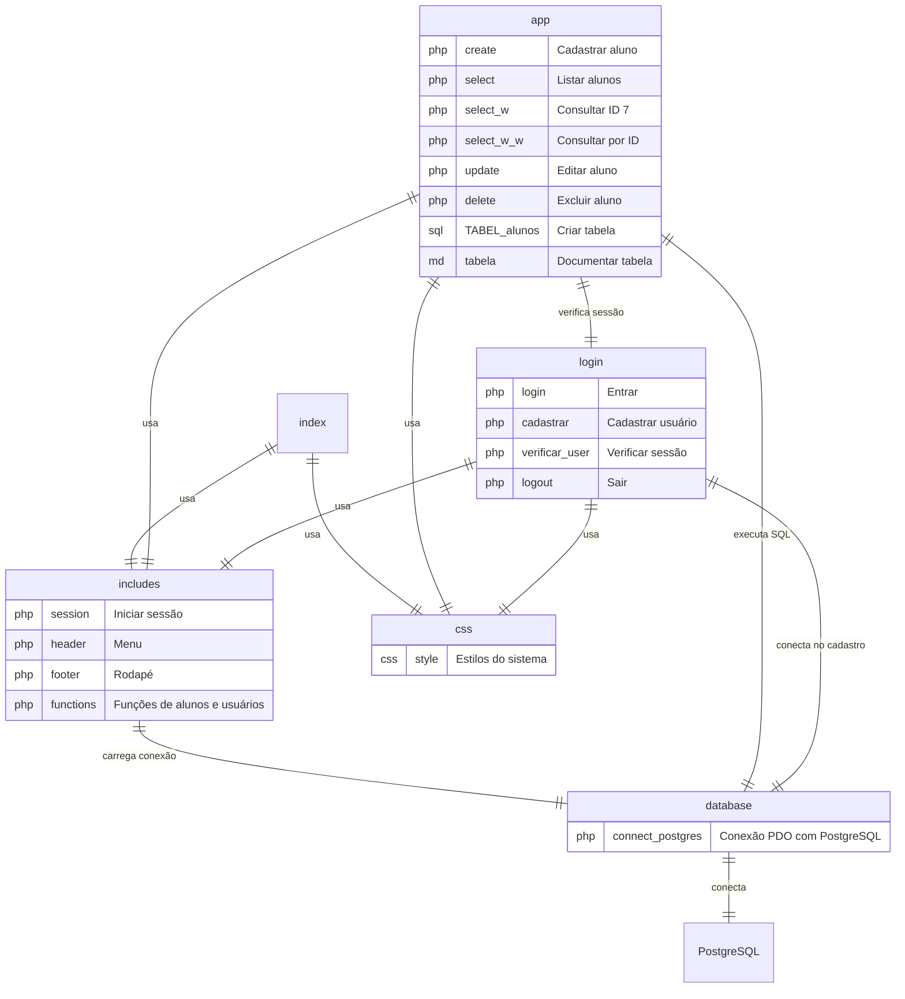

# Diagramas do sistema

## Estrutura e ligação entre as pastas

Os blocos mostram os arquivos e suas funções. As ligações representam o uso entre módulos, não relações entre tabelas do banco.

- **App:** cadastro, consulta, edição e exclusão de alunos.
- **Login:** acesso ao sistema e verificação de sessão.
- **Includes:** arquivos compartilhados pelas páginas.
- **Database:** conexão com o banco de dados.
- **CSS:** aparência das páginas.

