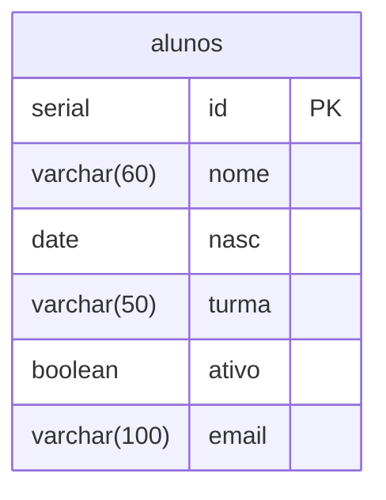

# Diagramas do CRUD

Os arquivos do CRUD utilizam a tabela `alunos`.

O campo `id` é a chave primária e não há chave estrangeira definida.

## Tabela alunos

## create.php

Cadastra um novo aluno.

O campo `id` é gerado automaticamente pelo banco de dados.

## select.php

Lista os alunos cadastrados em ordem do  menor pro maior com base no  `id`.

## select_w.php

Busca um aluno pelo `id` informado e mostra os seus dados.

## select_w_w.php

Busca e mostra um aluno específico pelo `id` informado.

## update.php

Busca um aluno pelo `id` e permite alterar:

- nome
- data de nascimento
- turma
- situação do aluno
- e-mail

## delete.php

Busca um aluno pelo `id`.

Antes da exclusão, mostra o nome e a turma do aluno e pede confirmação para excluir.
