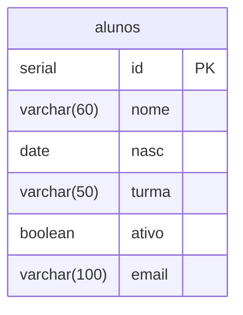

# Diagramas do CRUD

Cada diagrama mostra a tabela usada pelo arquivo de `app/`. Todos usam `alunos`: `id` é PK e não há FK definida.

## create.php

- Cadastra o aluno. O banco gera o id automaticamente.

## select.php

- Lista os alunos em ordem de id.

## select_w.php

- Busca o aluno com id buscado e mostra os demais campos.

## select_w_w.php

- Busca e mostra o aluno pelo id informado.

## update.php

- Busca pelo id e altera nome, nasc, turma, ativo e email.

## delete.php

- Busca pelo id, mostra nome e turma e exclui após confirmação.

