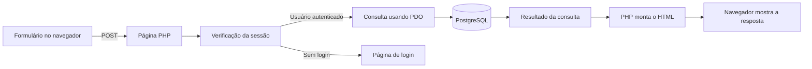
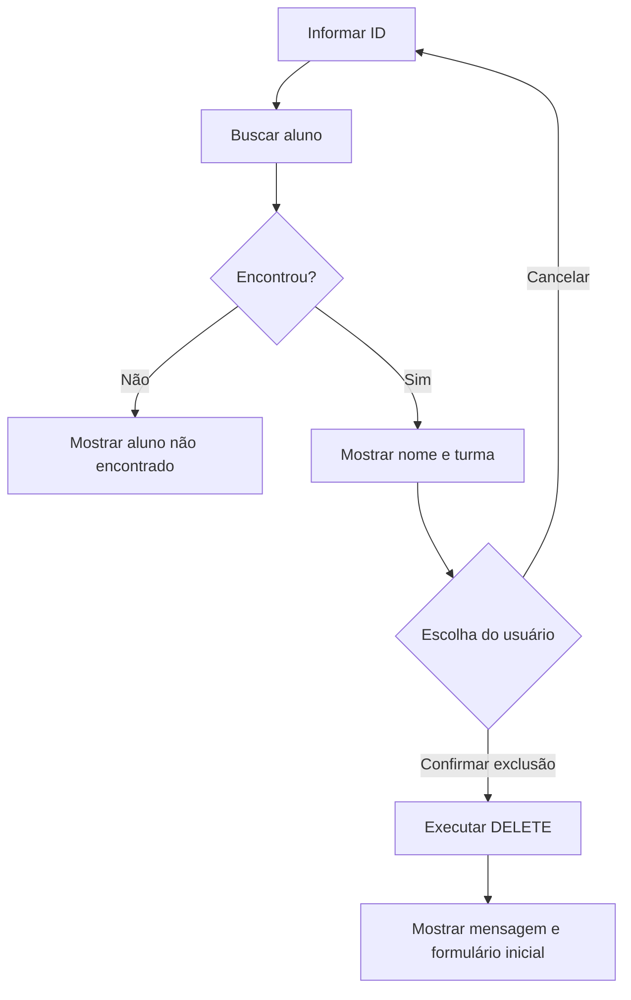

# Impulso Cursos — Documentação do sistema

Guia para executar, compreender e apresentar o projeto de gestão de alunos.

**Início rápido:** [README](README.md) · **Página inicial:** [index.php](index.php) · **Estilos:** [style.css](css/style.css)

## Como usar este guia

| Quero… | Onde encontrar |
| --- | --- |
| Rodar o site no computador | [Preparação e execução](#2-preparacao) |
| Encontrar a responsabilidade de um arquivo | [Estrutura](#3-estrutura) e [páginas](#4-paginas) |
| Entender os dados e as consultas | [Banco e funções](#5-dados) |
| Aprender com exemplos do projeto | [Conceitos](#6-conceitos) e [exemplos](#7-exemplos) |
| Conferir o funcionamento ou investigar um problema | [Testes](#8-testes) e [dúvidas frequentes](#9-duvidas) |
| Preparar uma explicação do trabalho | [Roteiro de estudo](#12-estudo) |

## Sumário

1. [Visão geral](#1-visao-geral)
2. [Preparação e execução](#2-preparacao)
3. [Estrutura e fluxo de dados](#3-estrutura)
4. [Referência das páginas](#4-paginas)
5. [Banco de dados e funções](#5-dados)
6. [Conceitos usados no código](#6-conceitos)
7. [Exemplos explicados](#7-exemplos)
8. [Conferência manual](#8-testes)
9. [Dúvidas frequentes](#9-duvidas)
10. [Limitações da versão atual](#10-limitacoes)
11. [Histórico e backup](#11-backup)
12. [Roteiro de estudo](#12-estudo)

---

<a id="1-visao-geral"></a>

## 1. Visão geral

A Impulso Cursos é uma empresa fictícia de educação. O sistema apresenta os cursos e permite cadastrar, consultar, atualizar e excluir alunos. Os usuários que acessam a gestão fazem login com e-mail e senha.

Esta documentação descreve os 16 arquivos PHP presentes no projeto. As informações sobre o banco são baseadas nas consultas do código, não em uma inspeção da estrutura do servidor.

### Tecnologias utilizadas

| Tecnologia | Utilização |
| --- | --- |
| HTML | Estrutura das páginas, formulários e tabela do relatório. |
| CSS | Cores, espaçamento, cartões, campos e adaptação para celular em `css/style.css`. |
| PHP | Recebimento dos formulários, controle de sessão e operações no banco. |
| PDO | Conexão do PHP com o PostgreSQL e execução das consultas. |
| PostgreSQL | Armazenamento dos alunos e usuários. |

---

<a id="2-preparacao"></a>

## 2. Preparação e execução

1. Tenha PHP com PDO e o driver PostgreSQL habilitados.
2. Tenha acesso ao servidor PostgreSQL e às tabelas necessárias.
3. Confira a configuração em `database/connect_postgres.php`.
4. Mantenha a pasta do projeto com o nome `mini_sistema`, usado nos links.
5. Abra o terminal na pasta que contém `mini_sistema` e execute:

```powershell
php -S localhost:8000
```

6. Abra `http://localhost:8000/mini_sistema/index.php`.
7. Faça login para acessar as páginas de gestão.

Abrir o PHP diretamente como arquivo no navegador não executa o código. O servidor PHP precisa estar rodando.

---

<a id="3-estrutura"></a>

## 3. Estrutura e fluxo de dados

```text
mini_sistema/
├── index.php                    # Apresentação da empresa
├── app/
│   ├── create.php               # Cadastro de aluno
│   ├── select.php               # Relatório e acesso à edição
│   ├── select_w_w.php           # Consulta pelo ID informado
│   ├── select_w.php             # Consulta com ID fixo
│   ├── update.php               # Carregamento e atualização
│   └── delete.php               # Busca e confirmação de exclusão
├── includes/
│   ├── header.php               # Menu compartilhado
│   ├── footer.php               # Rodapé compartilhado
│   ├── session.php              # Inicialização da sessão
│   └── functions.php            # Funções de acesso aos dados
├── login/
│   ├── login.php                # Autenticação
│   ├── cadastrar.php            # Cadastro de usuário de acesso
│   ├── verificar_user.php       # Proteção das páginas
│   └── logout.php               # Encerramento da sessão
├── database/
│   └── connect_postgres.php     # Conexão PDO
├── css/
│   └── style.css               # Estilos compartilhados
├── README.md
└── documentacao.md
```

A árvore destaca os arquivos explicados neste guia; arquivos auxiliares de SQL e anotações não estão representados.

### Como uma página recebe e devolve informações



Esse diagrama resume as operações protegidas. Algumas páginas carregam a conexão antes de verificar o usuário, mas a operação do formulário ocorre depois da verificação. O navegador exibe o HTML gerado; as consultas SQL são executadas pelo PHP no servidor.

---

<a id="4-paginas"></a>

## 4. Referência das páginas

### 4.1. Página inicial

**`index.php`** inicia a sessão e inclui o cabeçalho e o rodapé. Apresenta o nome da empresa, o slogan e três cartões: Informática Básica, Inglês e Administração. Os textos e as durações estão escritos no HTML; não são carregados do banco. A página não exige login.

### 4.2. Componentes compartilhados

| Arquivo | Função |
| --- | --- |
| `header.php` | Mostra o menu com Início, Cadastrar, Excluir, Relatório, Consultar, Entrar e Sair. Entrar e Sair ficam sempre visíveis. Atualmente não existe a opção Atualizar no menu. |
| `footer.php` | Exibe o texto do rodapé. |
| `session.php` | Verifica se existe uma sessão ativa e chama `session_start()` quando necessário. |
| `functions.php` | Carrega a conexão com o banco e reúne as funções de cadastro, consulta, atualização, exclusão e busca de usuários. |

### 4.3. Conexão com o banco

**`connect_postgres.php`** define host, nome do banco, usuário e senha e cria o objeto `$conexao` com `new PDO(...)`. O banco configurado no código é `escola`. Se ocorrer uma exceção de conexão, o bloco `catch` mostra a mensagem de erro. As credenciais devem ser consultadas no próprio arquivo; não são repetidas aqui.

### 4.4. Acesso e sessão

| Arquivo | Funcionamento |
| --- | --- |
| `login.php` | Recebe e-mail e senha por POST, busca o usuário com `consultar_user()` e compara os dados. Quando correspondem, renova o ID da sessão, guarda o ID do usuário em `$_SESSION['id']` e redireciona ao início. Caso contrário, mostra uma mensagem de erro. |
| `cadastrar.php` | Mostra o formulário de cadastro de usuário e chama `cadastrar_user()` ao receber POST. Depois tenta redirecionar ao início. Cadastrar usuário não equivale a cadastrar aluno nem realiza login automaticamente. |
| `verificar_user.php` | Verifica a sessão. Se `$_SESSION['id']` não existir, redireciona para o login e encerra a execução com `exit()`. |
| `logout.php` | Limpa os dados de sessão, destrói a sessão e redireciona para `/mini_sistema/index.php`. |

### 4.5. Gestão de alunos

Todas as páginas PHP dessa pasta incluem a verificação de login.

#### `create.php` — Cadastro de aluno

Mostra os campos nome, turma, e-mail, nascimento e situação ativa. A turma é escolhida em um `select`:

| Valor enviado | Opção exibida |
| --- | --- |
| `INF-01` | Informática Básica |
| `ING-01` | Inglês |
| `ADM-01` | Administração |

Ao receber POST, a própria página prepara e executa um `INSERT INTO alunos`. Depois mostra “Aluno cadastrado com sucesso!”. Embora exista a função `cadastrar()`, esta página executa o cadastro diretamente.

#### `select.php` — Relatório

Chama `listarAlunos()` e percorre os resultados com `foreach`. Mostra uma tabela com ID, nome, nascimento, turma, e-mail, situação e ações. A consulta usa `ORDER BY id ASC`, organizando os alunos do menor ID para o maior. Sem registros, mostra “Nenhum aluno cadastrado”.

Cada botão Editar pertence a um formulário que envia o ID por POST para `update.php`. O ID vai em um campo `hidden`, que não aparece na tela.

#### `update.php` — Edição

1. Recebe o ID enviado pelo relatório ou pela busca da própria página.
2. Executa um SELECT para carregar o aluno.
3. Preenche os campos com os dados encontrados e marca a opção ativa correspondente.
4. Quando recebe também o campo `nome`, chama `Atualizar()` para salvar os dados.
5. Consulta novamente o registro e mantém o formulário preenchido com os dados do banco.

A confirmação exibida é “ALUNO ATUALIZADO COM SUCESSO! VOLTE AO RELATÓRIO PARA CONFERIR.”. Não há redirecionamento automático ao relatório. O botão Restaurar campos repõe os valores com que o formulário foi carregado, sem alterar o banco.

#### `delete.php` — Exclusão com confirmação

1. O usuário informa o ID e clica em Continuar para exclusão.
2. A página busca o aluno e mostra ID, nome e turma.
3. Confirmar exclusão envia novamente o ID e também o campo `confirmar`.
4. Somente ao receber esse campo a página chama `apagar()`.

Cancelar abre `delete.php` sem enviar o formulário de confirmação. Se o aluno não existir, a página mostra “Aluno não encontrado”. Depois de apagar, volta a mostrar o campo de busca. No código atual, o campo de ID aceita de 1 a 255 no navegador.

#### `select_w_w.php` — Consulta por ID

É a página aberta pelo menu Consultar. Recebe o ID por POST e chama `read_w_w()` quando o valor é menor que 2147483647. Mostra os dados encontrados ou uma mensagem de ausência de registro. O link Consultas RL abre o relatório.

#### `select_w.php` — Consulta com ID fixo

Define `$id = 7` no código e chama `Consultar()`. Não é a página ligada ao menu Consultar e não tem formulário para escolher outro ID.

---

<a id="5-dados"></a>

## 5. Banco de dados e funções

### 5.1. Dados utilizados

O código utiliza duas tabelas distintas:

| Tabela | Campos usados | Finalidade |
| --- | --- | --- |
| `alunos` | `id`, `nome`, `nasc`, `turma`, `ativo`, `email` | Cadastro dos alunos. |
| `usuarios` | `id`, `email`, `senha` | Contas de acesso ao sistema. |

O ID identifica cada registro. O campo `ativo` representa a situação do aluno; ele não determina se um usuário pode fazer login. As turmas são valores gravados em `alunos.turma`, sem uma tabela de cursos usada pelo código atual.

### 5.2. Funções de acesso aos dados

Arquivo: [includes/functions.php](includes/functions.php).

| Função | O que faz |
| --- | --- |
| `cadastrar($conexao, $nome, $turma, $nasc, $ativo, $email)` | Insere um aluno e mostra uma mensagem. Não é chamada pela página de cadastro atual. |
| `listarAlunos($conexao)` | Retorna todos os alunos com `fetchAll()`, ordenados pelo ID. |
| `apagar($conexao)` | Lê o ID de `$_POST`, executa DELETE e mostra “Registro deletado.”. A confirmação acontece na página `delete.php`. |
| `Consultar($conexao, $id)` | Busca um aluno e escreve seus dados na página. Usada em `select_w.php`. |
| `Atualizar($conexao, $id, $nome, $turma, $nasc, $ativo, $email)` | Executa UPDATE para o ID informado e mostra a confirmação de atualização. |
| `read_w_w($conexao, $id)` | Busca e exibe os dados do aluno e um link para voltar ao início. |
| `cadastrar_user($conexao, $email, $senha)` | Insere os dados de acesso na tabela `usuarios`. |
| `consultar_user($conexao, $email)` | Busca ID, e-mail e senha e retorna o usuário para o login. |

---

<a id="6-conceitos"></a>

## 6. Conceitos usados no código

- `include`: inclui um arquivo, como o cabeçalho ou rodapé.
- `require_once`: carrega um arquivo necessário apenas uma vez na execução.
- `__DIR__`: representa a pasta do arquivo PHP no computador. É usado para localizar arquivos incluídos.
- `header('Location: ...')`: envia um redirecionamento para uma URL. Não usa um caminho físico do disco.
- `$_SERVER['REQUEST_METHOD']`: permite verificar se a página recebeu POST.
- `$_POST`: contém os campos enviados pelo formulário, identificados pelo atributo `name`.
- `isset`: verifica se uma variável ou campo existe e não é nulo.
- `$_SESSION`: guarda informações associadas à sessão do visitante entre requisições.
- `prepare`: prepara o SQL com parâmetros como `:id`.
- `bindParam`: vincula uma variável ao parâmetro da consulta.
- `execute`: executa o comando preparado.
- `fetch(PDO::FETCH_ASSOC)`: obtém uma linha com os nomes das colunas como chaves.
- `fetchAll(PDO::FETCH_ASSOC)`: obtém todas as linhas do resultado.
- `htmlspecialchars`: transforma caracteres especiais para exibir texto no HTML. É usado, por exemplo, no relatório e no formulário de edição.
- `echo` e `<?= ... ?>`: escrevem conteúdo na resposta que o navegador recebe.

No HTML, `label` identifica o campo; `input` recebe um valor; `select` apresenta opções. O atributo `required` pede ao navegador que exija preenchimento. A classe CSS liga um elemento a regras de aparência: `class="course-card"`, por exemplo, identifica os cartões dos cursos.

---

<a id="7-exemplos"></a>

## 7. Exemplos explicados

### 7.1. do campo do formulário ao PHP

Trecho do cadastro:

```html
<label for="turma">Turma:</label>
<select name="turma" id="turma" required>
    <option value="" selected disabled>Selecione a turma</option>
    <option value="INF-01">INF-01 — Informática Básica</option>
    <option value="ING-01">ING-01 — Inglês</option>
    <option value="ADM-01">ADM-01 — Administração</option>
</select>
```

`for="turma"` conecta o texto do label ao campo que tem `id="turma"`. Já `name="turma"` define o nome enviado ao PHP. Ao escolher Inglês, o navegador envia o valor `ING-01`, que fica disponível em `$_POST['turma']`. O texto completo da opção é apenas o que o usuário vê.

### 7.2. buscar um aluno no banco

Trecho usado na página de exclusão, depois que o ID é recebido:

```php
$sql = 'SELECT * FROM alunos WHERE id = :id';
$stmt = $conexao->prepare($sql);
$stmt->bindParam(':id', $id);
$stmt->execute();
$aluno = $stmt->fetch(PDO::FETCH_ASSOC);
```

| Etapa | Explicação |
| --- | --- |
| `SELECT ... WHERE id = :id` | Procura o registro com o ID informado. |
| `prepare($sql)` | Prepara a consulta, deixando o valor separado do SQL. |
| `bindParam(':id', $id)` | Liga o parâmetro à variável que contém o ID. |
| `execute()` | Envia a consulta para execução. |
| `fetch(...)` | Obtém um registro; sem resultado, retorna `false`. |

Quando a busca encontra um aluno, `$aluno['nome']` acessa seu nome. A chave `nome` corresponde à coluna retornada pelo banco.

### 7.3. por que buscar não exclui?

A primeira etapa só envia o ID. O formulário seguinte contém este botão:

```html
<input type="submit" name="confirmar" value="Confirmar exclusão">
```

A exclusão depende deste trecho, executado após encontrar o aluno:

```php
if (isset($_POST['confirmar'])) {
    apagar($conexao);
    $aluno = false;
}
```

`isset` identifica o campo enviado pelo botão de confirmação. A atribuição `$aluno = false` faz a página voltar a mostrar o formulário de busca; quem remove o registro é a função `apagar()`, não essa atribuição.



### 7.4. buscar para editar é diferente de salvar

O botão Editar do relatório envia somente o ID. A página carrega os dados, mas não altera o banco nessa etapa. Quando o formulário preenchido é enviado, chega também o campo `nome`:

```php
if ($aluno && isset($_POST['nome'])) {
    Atualizar($conexao, $id, $_POST['nome'], $_POST['turma'],
        $_POST['nasc'], $_POST['ativo'], $_POST['email']);
    $stmt->execute();
    $aluno = $stmt->fetch(PDO::FETCH_ASSOC);
}
```

A função faz o UPDATE. As duas linhas seguintes repetem a consulta SELECT preparada anteriormente e recuperam os dados salvos. Por isso, continuar no formulário preenchido depois de atualizar é esperado.

### 7.5. HTML e CSS no cartão de um curso

```html
<article class="course-card">
    <h3>Inglês</h3>
    <p>Desenvolva vocabulário e pratique conversas para situações do dia a dia.</p>
    <p class="course-duration">Duração: 12 meses</p>
</article>
```

`article` agrupa o conteúdo de um curso; `h3` é o título e `p` cria um parágrafo. A classe `course-card` permite aplicar as regras de `.course-card` no CSS. O texto apareceria mesmo sem essa classe: ela organiza a aparência, não cria as palavras.

### 7.6. Caminho de arquivo e endereço do navegador

```php
require_once __DIR__ . '/../includes/functions.php';
```

Esse caminho é resolvido no computador que executa o PHP. `..` significa subir uma pasta.

```php
header('Location: /mini_sistema/index.php');
exit();
```

Esse endereço é enviado ao navegador. `exit()` impede que o restante da página continue sendo executado após o redirecionamento.

---

<a id="8-testes"></a>

## 8. Conferência manual

| Ação | Resultado esperado |
| --- | --- |
| Abrir uma página de gestão sem login | Redirecionamento ao login. |
| Entrar com credenciais válidas | Acesso ao início com sessão autenticada. |
| Cadastrar um aluno de teste | Mensagem de sucesso e registro no relatório. |
| Abrir o relatório | IDs em ordem crescente. |
| Editar pelo relatório | Formulário preenchido; salvar mostra a confirmação. |
| Consultar um ID existente | Exibição dos dados correspondentes. |
| Consultar um ID inexistente válido | Mensagem informando que não há registro. |
| Buscar para excluir e cancelar | O aluno permanece no relatório. |
| Confirmar a exclusão de um aluno de teste | Registro removido do relatório. |
| Clicar em Sair | Sessão encerrada; páginas protegidas passam a exigir login. |

Este roteiro é uma orientação de teste, não um registro de testes executados durante a documentação.

---

<a id="9-duvidas"></a>

## 9. Dúvidas frequentes

| Situação | Explicação e verificação |
| --- | --- |
| Clicar em Cadastrar, Excluir ou Relatório volta ao login | As páginas exigem `$_SESSION['id']`. Entre antes de usá-las. |
| O endereço muda, mas a página não abre corretamente | Confira se o servidor foi iniciado na pasta que contém `mini_sistema`. Os links começam com `/mini_sistema/`. |
| Depois de atualizar, continuo com os campos preenchidos | Esse é o fluxo atual. Confira a mensagem de sucesso e volte ao relatório para ver o registro salvo. |
| O formulário não envia | Confira campos obrigatórios, formato de e-mail e limites numéricos indicados pelo navegador. |
| Não consigo excluir um ID maior que 255 | O formulário de exclusão atual tem `max="255"`. Isso é um limite do formulário, não uma conclusão sobre a capacidade do banco. |
| O visual antigo continua aparecendo | Atualize com `Ctrl + F5` e confira se o CSS está sendo carregado. |
| Aparece erro de conexão com o banco | Verifique se o servidor PostgreSQL está acessível e se a conexão está configurada corretamente. |
| O cadastro de usuário não redireciona | Confira a limitação de envio de cabeçalhos depois do HTML descrita na [seção 10](#10-limitacoes). |

---

<a id="10-limitacoes"></a>

## 10. Limitações da versão atual

- As senhas dos usuários são gravadas e comparadas diretamente, sem hash no código atual.
- O cadastro de usuário chama `header()` depois de produzir HTML e uma mensagem; o redirecionamento pode falhar se a saída já tiver sido enviada.
- Parte da validação está apenas no navegador. Os limites de ID também diferem entre as páginas: a exclusão limita o formulário a 255.
- O cadastro usa uma lista de turmas, mas a edição ainda permite texto livre para turma.
- As páginas de consulta individual escrevem alguns dados diretamente com `echo`, enquanto o relatório e a edição utilizam `htmlspecialchars`.
- A confirmação da exclusão depende do campo POST `confirmar`; não existe um token de proteção contra envio de formulário por outro site.
- Atualização e exclusão não conferem a quantidade de linhas afetadas antes de mostrar suas mensagens de sucesso.
- Atualizar a página após um POST pode solicitar o reenvio do formulário, pois não há redirecionamento após todas as operações.

Essas observações descrevem a implementação encontrada; gerar esta documentação não modifica esses comportamentos.

---

<a id="11-backup"></a>

## 11. Histórico e backup

O Git registra versões dos arquivos e o GitHub pode armazenar uma cópia do repositório. É necessário fazer commit e push após novas alterações para atualizar essa cópia. Os registros do PostgreSQL não são incluídos automaticamente: precisam de backup próprio.

---

<a id="12-estudo"></a>

## 12. Roteiro de estudo

Uma ordem prática para entender o código é começar pela tela e acompanhar o caminho dos dados:

1. Leia `index.php`, `header.php` e `footer.php` para entender a montagem das páginas.
2. Leia `create.php` e identifique como o atributo `name` vira uma chave em `$_POST`.
3. Leia `connect_postgres.php` e acompanhe `prepare`, `bindParam` e `execute` no cadastro.
4. Leia `select.php` e `listarAlunos()` para entender o `foreach` e a ordem dos IDs.
5. Siga o botão Editar até `update.php` e separe a etapa de carregar da etapa de salvar.
6. Leia `delete.php` e explique por que o campo `confirmar` muda a ação executada.
7. Leia `session.php`, `login.php`, `verificar_user.php` e `logout.php` para acompanhar o acesso do usuário.

### Perguntas para conferir o entendimento

- Qual é a diferença entre cadastrar um aluno e cadastrar um usuário?
- Por que o banco recebe `ING-01`, e não o texto inteiro da opção?
- Qual comando ordena o relatório por ID?
- Por que o botão Editar não salva imediatamente?
- O que acontece ao clicar em Cancelar na exclusão?
- Qual informação da sessão permite entrar nas páginas protegidas?
- Por que `__DIR__` é usado nos includes e não no endereço de redirecionamento?

### Exemplo de explicação do projeto

> O sistema gerencia alunos de uma empresa fictícia de cursos. O HTML apresenta os formulários, o CSS define a aparência e o PHP recebe os dados. Para salvar ou buscar registros, o PHP usa PDO para executar consultas no PostgreSQL. A sessão identifica o usuário conectado. O relatório permite acessar a edição de um aluno, e a exclusão pede confirmação antes de apagar o cadastro.
